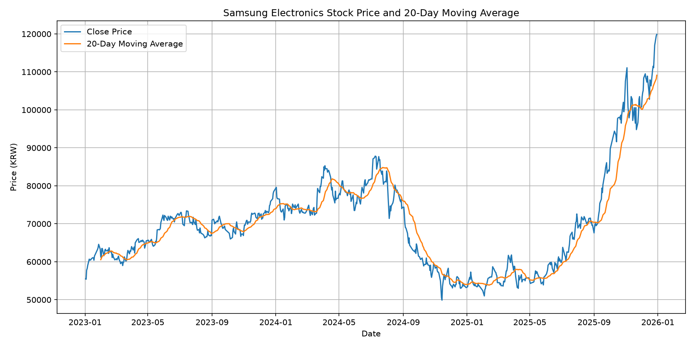
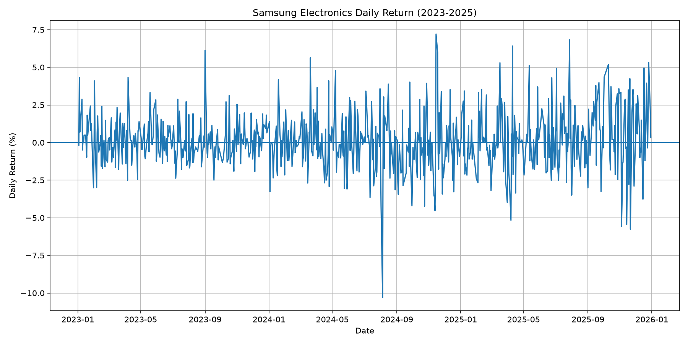
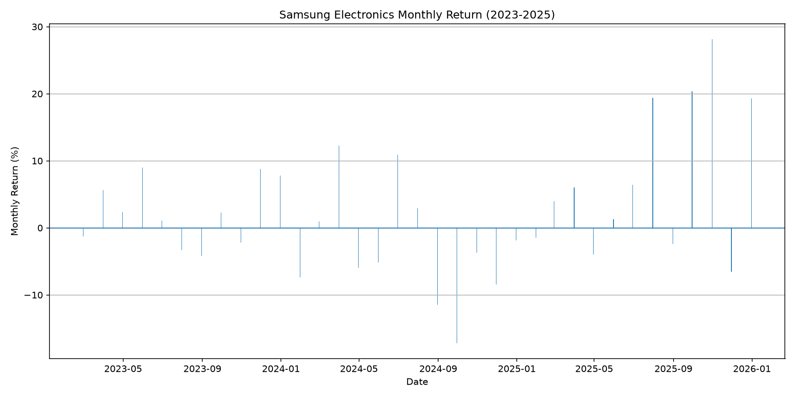
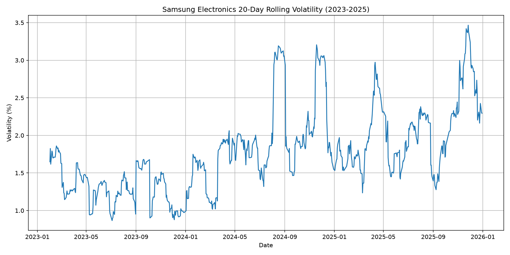

# 2023~2025년 삼성전자 주가의 추세와 변동성 분석

## 1. 분석 주제

**2023~2025년 삼성전자 주가의 추세와 변동성 분석**

본 분석에서는 2023년부터 2025년까지 삼성전자 주가 데이터를 이용하여 주가의 장기적인 추세와 기간별 변동성을 분석하였다.
이동평균, 일별 수익률, 월별 수익률, 이동 변동성 등의 시계열 분석 방법을 활용하여 주가가 어느 시기에 크게 상승하거나 하락했는지, 그리고 변동성이 높은 시점은 언제였는지를 확인하였다.

---

## 2. 분석 질문

이번 분석에서는 다음과 같은 질문을 설정하였다.

1. 2023~2025년 삼성전자 주가는 전체적으로 어떤 추세를 보였는가?
2. 분석 기간 중 주가가 크게 상승하거나 하락한 시점은 언제였으며, 변동 폭은 어느 정도였는가?
3. 월별 수익률을 비교했을 때 기간별로 어떤 차이가 나타났는가?
4. 삼성전자 주가의 변동성이 가장 높았던 시점은 언제였는가?

---

## 3. 데이터 설명

### 3-1. 데이터 출처

Yahoo Finance에서 삼성전자(005930.KS)의 주가 데이터를 수집하였다.

* 종목: 삼성전자
* 종목 코드: `005930.KS`
* 분석 기간: 2023-01-01 ~ 2025-12-31
* 실제 데이터 기간: 2023-01-02 ~ 2025-12-30
* 데이터 개수: **730개**
* 주요 변수: 시가(Open), 고가(High), 저가(Low), 종가(Close), 거래량(Volume)

### 3-2. 결측치 확인

전체 데이터의 결측치를 확인한 결과, 분석에 사용한 주요 변수에서 결측치가 발견되지 않았다.

따라서 별도의 결측치 제거 또는 대체 작업을 수행하지 않았다.

### 3-3. 데이터 전처리

주가의 추세를 분석하기 위해 종가(Close)를 중심으로 분석하였다.

추가적으로 다음과 같은 변수를 계산하였다.

* 20일 이동평균
* 일별 수익률
* 월별 수익률
* 20일 이동 변동성

---

## 4. 분석 방법

### 4-1. 20일 이동평균

단기적인 주가 변동을 완화하고 전체적인 추세를 확인하기 위해 20일 이동평균을 계산하였다.

이동평균은 최근 20거래일의 종가 평균을 이용하였다.

### 4-2. 일별 수익률

하루 동안 주가가 얼마나 변했는지를 확인하기 위해 일별 수익률을 계산하였다.

수익률은 다음과 같이 계산하였다.

> 일별 수익률 = (당일 종가 / 전일 종가 - 1) × 100

이를 통해 분석 기간 중 가장 크게 상승하거나 하락한 거래일을 확인하였다.

### 4-3. 월별 수익률

월별 주가 변화를 비교하기 위해 각 월의 마지막 거래일 종가를 기준으로 월별 수익률을 계산하였다.

이를 통해 특정 연도 또는 시기에 상승과 하락이 집중되는지 확인하였다.

### 4-4. 20일 이동 변동성

최근 20거래일의 일별 수익률 표준편차를 계산하여 주가의 변동성을 확인하였다.

변동성이 높을수록 해당 기간 동안 일별 주가 변화가 상대적으로 크게 나타났음을 의미한다.

---

## 5. 시각화 결과

### 5-1. 삼성전자 주가와 20일 이동평균



주가의 단기적인 움직임과 비교하여 20일 이동평균을 함께 표시하였다.

**관찰:**
주가는 짧은 기간에도 상승과 하락을 반복했으며, 이동평균선은 이러한 단기적인 변동을 완화하여 전체적인 추세를 보여준다.

**해석:**
이동평균을 함께 확인하면 개별 거래일의 급격한 가격 변화보다 일정 기간 동안의 주가 흐름을 파악하는 데 도움이 된다.

---

### 5-2. 일별 수익률



일별 수익률을 이용하여 하루 단위의 주가 변동 폭을 확인하였다.

**관찰:**
분석 기간 중 가장 큰 상승률은 **2024년 11월 15일의 +7.21%**였으며, 가장 큰 하락률은 **2024년 8월 5일의 -10.30%**였다.

**해석:**
특정 거래일에는 평소보다 큰 폭의 주가 변화가 발생했음을 확인할 수 있다. 특히 2024년 8월 5일에는 분석 기간 중 가장 큰 일별 하락이 나타났다.

---

### 5-3. 월별 수익률



월별 수익률을 비교하여 기간별 상승 및 하락 정도를 확인하였다.

**관찰:**
2024년 8월과 9월에는 각각 **-11.44%, -17.23%**의 월별 수익률이 나타났다.

반면 2025년에는 7월 **+19.40%**, 9월 **+20.37%**, 10월 **+28.13%**, 12월 **+19.30%** 등 큰 폭의 월간 상승이 나타났다.

**해석:**
2024년 하반기에는 비교적 큰 월간 하락이 나타난 반면, 2025년 하반기에는 큰 폭의 상승과 하락이 반복되었다. 따라서 분석 기간 전체가 동일한 방향으로 움직인 것이 아니라 시기에 따라 주가 흐름에 차이가 있었음을 확인할 수 있다.

---

### 5-4. 20일 이동 변동성



최근 20거래일의 일별 수익률 표준편차를 이용하여 기간별 변동성을 확인하였다.

**관찰:**
20일 이동 변동성이 가장 높았던 시점은 **2025년 11월 26일**이며, 변동성은 **3.47%**였다.

**해석:**
2025년 11월 26일을 전후한 기간에는 다른 기간보다 일별 주가 변화의 폭이 상대적으로 크게 나타났다고 볼 수 있다.

---

## 6. 주요 분석 결과

### 결과 1. 2024년 하반기에 큰 폭의 하락이 나타났다.

**관찰된 사실:**
2024년 8월 월별 수익률은 **-11.44%**, 9월은 **-17.23%**로 나타났다. 또한 2024년 8월 5일에는 하루 동안 **-10.30%**의 하락률을 기록했다.

**해석:**
2024년 하반기의 일부 기간에는 삼성전자 주가의 하락 폭이 크게 나타났으며, 특히 8~9월에 월간 기준으로 큰 하락이 집중되어 있었다.

---

### 결과 2. 2025년 하반기에는 큰 폭의 월간 변동이 반복되었다.

**관찰된 사실:**
2025년 7월은 **+19.40%**, 9월은 **+20.37%**, 10월은 **+28.13%**, 12월은 **+19.30%**의 월별 수익률을 기록했다. 반면 8월은 **-2.38%**, 11월은 **-6.51%**로 하락하였다.

**해석:**
2025년 하반기에는 월별 주가 변화의 폭이 크게 나타났으며, 상승한 달과 하락한 달이 함께 나타나는 등 변동성이 큰 흐름을 보였다.

---

### 결과 3. 가장 높은 20일 이동 변동성은 2025년 11월에 나타났다.

**관찰된 사실:**
20일 이동 변동성의 최고값은 **2025년 11월 26일의 3.47%**였다.

**해석:**
해당 날짜를 전후한 20거래일 동안 일별 수익률의 변동 폭이 분석 기간 내 다른 구간보다 크게 나타났다고 볼 수 있다.

---

## 7. 결론

이번 분석에서는 2023~2025년 삼성전자 주가 데이터를 이용하여 주가의 추세와 변동성을 분석하였다.

20일 이동평균을 통해 단기적인 가격 변동을 완화하여 전체적인 주가 흐름을 확인하였으며, 일별 수익률을 통해 하루 단위의 큰 상승과 하락이 나타난 시점을 확인하였다. 또한 월별 수익률을 비교하여 시기별 주가 변화의 차이를 확인하고, 20일 이동 변동성을 이용하여 변동성이 높은 기간을 확인하였다.

분석 결과, 삼성전자 주가는 3년 동안 일정한 방향으로만 움직이지 않았으며 시기에 따라 상승과 하락의 폭이 크게 달라졌다. 특히 2024년 하반기에는 큰 폭의 월간 하락이 나타났고, 2025년 하반기에는 큰 폭의 월간 상승과 하락이 반복되었다.

다만 본 분석은 주가 데이터 자체를 중심으로 한 분석이므로 주가가 특정 시점에 상승하거나 하락한 **원인까지 설명할 수는 없다.** 실제 원인을 파악하기 위해서는 해당 기간의 기업 실적, 반도체 산업 상황, 경제 지표, 시장 뉴스 등의 추가적인 자료가 필요하다.

---

## 8. 분석의 한계

첫째, 본 분석은 삼성전자 한 종목의 주가만을 대상으로 하였기 때문에 다른 기업이나 시장 전체의 움직임과 직접 비교하기 어렵다.

둘째, 주가 데이터의 움직임을 통계적으로 분석했을 뿐, 각 상승 및 하락의 원인이 되는 경제적·기업적 요인을 함께 분석하지 않았다.

셋째, 과거의 주가 움직임만을 분석한 것이므로 미래의 주가를 예측하거나 투자 결과를 보장하는 분석으로 사용할 수 없다.

따라서 향후에는 삼성전자와 코스피 지수의 움직임을 비교하거나 반도체 산업 관련 지표 및 기업 실적 자료를 추가하여 주가 변화의 원인을 함께 분석할 필요가 있다.

---

## 9. 사용한 기술 및 라이브러리

* Python
* pandas
* matplotlib
* yfinance

### 주요 분석 기법

* 20일 이동평균
* 일별 수익률
* 월별 수익률
* 20일 이동 변동성(표준편차)

---

## 10. 실행 방법

필요한 라이브러리를 설치한 후 `analysis.py`를 실행한다.

```bash
pip install pandas matplotlib yfinance
python analysis.py
```

실행하면 삼성전자 주가 데이터를 수집하고 분석 결과 및 시각화 파일을 생성한다.

분석 데이터는 `data/` 폴더에 저장되며, 그래프 이미지는 `images/` 폴더에 저장된다.

---

## 11. AI 활용 기록

### AI 활용 목적

Python 코드 작성 과정에서 시계열 데이터 분석 방법과 코드 작성 방법을 이해하고, 분석 결과를 정리하기 위해 AI를 활용하였다.

### AI 활용 내용

* Python 분석 코드 작성 및 수정
* 이동평균, 수익률, 변동성 계산 방법 확인
* 분석 결과 해석 및 보고서 구성에 대한 도움

### 검증 방법

AI가 제시한 코드를 직접 실행하여 오류 여부를 확인하였으며, Python에서 출력된 데이터 개수, 기간, 결측치, 최대 상승·하락률, 월별 수익률 및 변동성 값을 직접 확인하였다.

따라서 보고서에 사용한 주요 수치는 실제 실행 결과를 기준으로 작성하였다.
